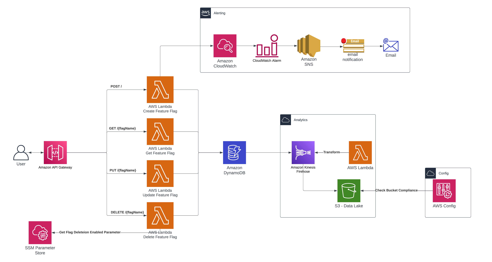

# AWS enhanced Serverless Feature Flag Service

This repo contains an AWS Serverless application using CDK to define the Infrastructure, written in C#. This defines an application that will deploy an API and CRUD code to allow feature flags to be created, retrieved, updated and delete using DynamoDB as storage.

## Overview

The premise of this is to extend the original aws basic enhanced feature flag service but also to demostrate more serverless services and as well take the learning from the Devops Professional certification and have real life examples of the main teachings such as Config, Kinesis, DynamoDB Streams, SSM Parameter Store and CloudWatch, CloudWatch Metrics and CloudWatch Alarms. The end goal is hopefully to have an application that integrates many different aws services defined in CDK written in C#

To demonstrate cloud watch metrics and cloud watch alarms I created a cloud wathc metric on the word 'Error' and an alarm which publishes an sns topic when the sum of errors over a 5 minute period is above a threshold of 0. Ideally this would be on all of the lambdas and the threshold would potentially be above 0 but for this demonstration i've kept it simple.

To further demonstrate Devops practices I have integrated SSM Parameter Store in the delete function handler. This will attempt to retrieve a parameter called 'allow-flag-deletion'. If the parameter value is false then a user would be unable to delete a flag. While this is a simple use of the parameter store it demonstrates using it in a lambda and the approach could be used if a particular instance of this service didn't want to allow flags to be deleted.

Another example of the teachings from the developer professional certificate is using DynamoDB Streams to stream into kinesis firehose when there is a change to an item, which uses a lambda to transform the data which in the case is putting a line break between json entries into S3. The idea behind this is to have an audit history of gets, delete, inserts and updates. This would also allow a quicksight dashboard to be created to further explore the audit history.

The final example of an AWS service being defined in CDK is using AWS Config. As detailed below currently due to a bug I was unable to create an automatic remediation rule in Config. But the idea behind this is to demonstrate a S3 bucket being made public and AWS config automatically remedying the permissions on bucket.

## Flow

Each action on the api has basic validation which includes verifying the flagName is in the the path and that flagName and value are in the request body where applicable.

### Create
1. User creates a feature flag via the api using a POST request
2. API Gateway invokes a lambda using a proxy integration
3. The handler of the Create lambda queries DynamoDB to ensure flag does not exist, if it does an error is returned.
4. If flag does not exist feature flag name and value is saved in DynamoDB
5. When flag have been retrieved, LastAccessed is updated with the current time.

### Retrieve
1. User retrieves a feature flag via the api using a GET request
2. API Gateway invokes a lambda using a proxy integration
3. The handler of the Get lambda queries DynamoDB to retrieve the flag.
4. If flag does not exist an error is returned otherwise a successful response including name and value are returned.

### Update
1. User updates a feature flag via the api using a PUT request
2. API Gateway invokes a lambda using a proxy integration
3. The handler of the Update lambda queries DynamoDB to ensure flag exists, if it does not exist an error is returned.
4. If flag does exist feature flag value is updated and saved in DynamoDB

### Delete
1. User deletes a feature flag via the api using a DELETE request
2. API Gateway invokes a lambda using a proxy integration
3. The handler makes a request to SSM Parameter Store to retrieve 'allow-flag-deletion' parameter, and error is returned if value is false.
4. If this is true then lambda queries DynamoDB to ensure flag exists, if it does not an error is returned.
5. If flag does exist feature flag is deleted from DynamoDB.

## Further Work
I was unable to create a automatic remediation rule using CDK due to a bug, but the Role has been created so that it can be manually created, Once this bug is fixed i would revisit to define this in CDK.

Further to this I would create a quicksight dashboard on the data being stored in s3.

## Deployment

The `cdk.json` file contains the information needed for the CDK Toolkit to execute your app.

Running the deploy.bat will deploy this application.

**Beware!** This is a prototype of how a feature flag service can be ran using serverless and CDK, this is not intended for production use as this has no authentication and only basic validation.